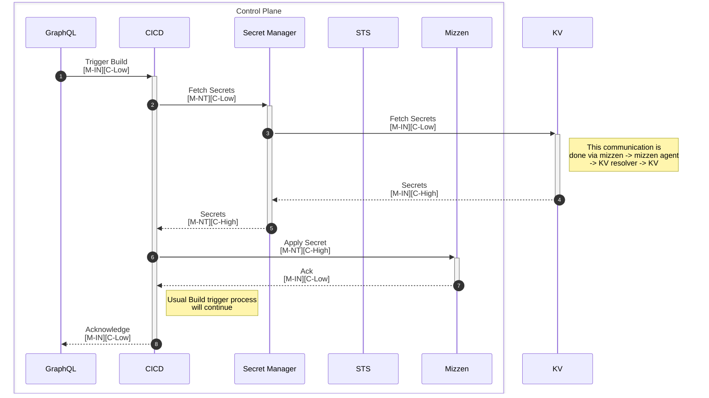

# Choreo Samples

## Sample Go Greeter:

#### Use the following config when creating this component in Choreo:

- Dockerfile: `go/greeter/Dockerfile`
- Docker context: `go/greeter/`

#### Running the sample locally

```shell
go run main.go
```


